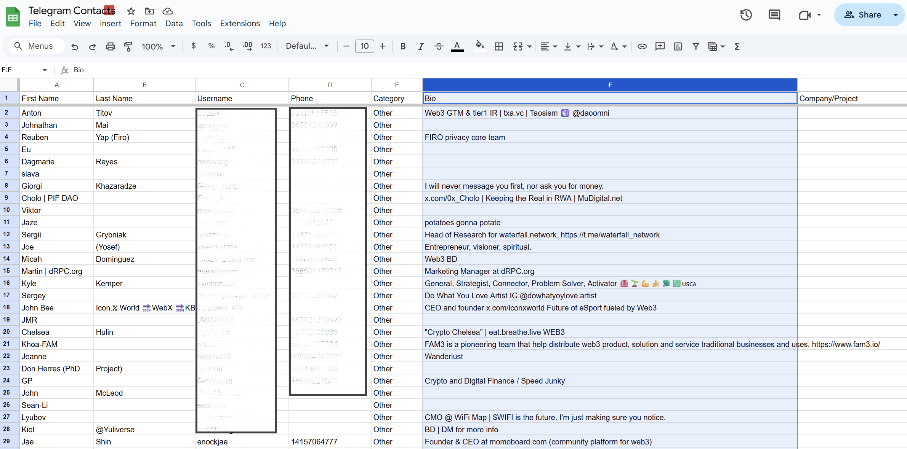
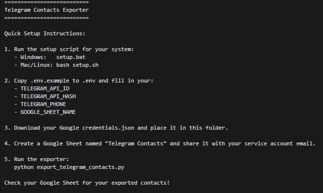
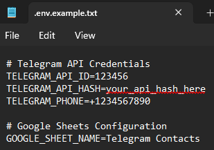

# Telegram Contacts Exporter

## 🐍 Install Python (Required)

If you do not already have Python 3.8 or newer installed, follow these steps:

1. Go to the official Python download page: https://www.python.org/downloads/
2. Click the yellow "Download Python" button (the latest version is recommended).
3. Run the downloaded installer.
4. **Important:** On the first screen, check the box that says "Add Python to PATH" before clicking "Install Now".
5. Complete the installation.
6. To verify Python is installed, open a terminal (Command Prompt on Windows, Terminal on Mac/Linux) and run:
   ```bash
   python --version
   ```
   You should see something like `Python 3.10.0` or higher.

Now you are ready to continue with the Quick Start below!

## 🚀 Quick Start

**Clone the repository:**
```bash
git clone https://github.com/micahdominguez/tg-contacts-exporter.git
cd tg-contacts-exporter
```

**Run the setup script:**

- **Windows:**  
  Double-click `setup.bat` or run:
  ```bash
  setup.bat
  ```

- **Mac/Linux:**  
  Open a terminal and run:
  ```bash
  bash setup.sh
  ```

**Follow the on-screen instructions:**
1. Copy `.env.example` to `.env` and fill in your Telegram and Google credentials.
2. Download your Google `credentials.json` and place it in this folder.
3. Create a Google Sheet named `Telegram Contacts` and share it with your service account email.
4. **Important:** Activate the Google Drive API for your Google Cloud project at https://console.cloud.google.com/apis/library/drive.googleapis.com

## ⚡️ Testing with a Few Contacts (Recommended)

**Note:** Running the script for all contacts may take a few minutes (or longer if you have many contacts), due to Telegram's rate limits. It's a good idea to test with just 10 contacts first:

1. Open `export_telegram_contacts.py` in a text editor.
2. Find the line:
   ```python
   for user in contacts.users:
   ```
3. Change it to process only the first 10 contacts:
   ```python
   for user in contacts.users[:10]:
   ```
4. Run the script and check your Google Sheet.
5. Once you confirm it works, change the line back to process all contacts:
   ```python
   for user in contacts.users:
   ```

5. Run the exporter:
   ```bash
   python export_telegram_contacts.py
   ```

**Check your Google Sheet for your exported contacts!**

See below for screenshots and more details.

Automatically export and categorize your Telegram contacts to Google Sheets.

## Features

- Direct integration with Telegram API
- Automatic contact categorization
- Google Sheets integration
- Detailed logging
- Error handling
- Environment variable configuration

## Setup Instructions

1. Install dependencies:
   ```bash
   pip install -r requirements.txt
   ```

2. Get Telegram API credentials:
   - Visit https://my.telegram.org
   - Log in and go to "API Development Tools"
   - Create a new application
   - Copy your API ID and API Hash

3. Set up Google Sheets API:
   - Go to https://console.cloud.google.com/
   - Create a new project
   - Enable Google Sheets API
   - Create Service Account credentials
   - Download credentials.json
   - Create a new Google Sheet named "Telegram Contacts"
   - Share the sheet with the service account email

4. Configure environment:
   - Create a `.env` file in the project root
   - Add the following variables:
     ```
     TELEGRAM_API_ID=your_api_id_here
     TELEGRAM_API_HASH=your_api_hash_here
     TELEGRAM_PHONE=your_phone_number_here
     GOOGLE_SHEET_NAME=Telegram Contacts
     ```

5. Run the script:
   ```bash
   python export_telegram_contacts.py
   ```

## Customization

- Modify the `categorize_contact` method in `export_telegram_contacts.py` to change categorization logic
- Add more fields to export by modifying the headers and row data
- Adjust logging level in the script if needed

## Troubleshooting

- Check `telegram_export.log` for detailed error messages
- Ensure all environment variables are set correctly
- Verify Google Sheets API credentials and permissions
- Make sure the Google Sheet exists and is shared with the service account

## Security Notes

- Never commit your `.env` file or `credentials.json` to version control
- Keep your API credentials secure
- Regularly rotate your API credentials if possible

## Screenshots

### Exported Telegram Contacts in Google Sheets

*Your contacts, including bios, exported to Google Sheets.*

### Setup Instructions in Terminal

*Quick setup instructions shown in the terminal for easy onboarding.*

### .env Example File

*Example .env file—fill in your own credentials as shown.* 